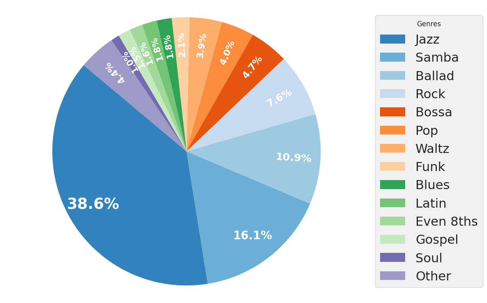
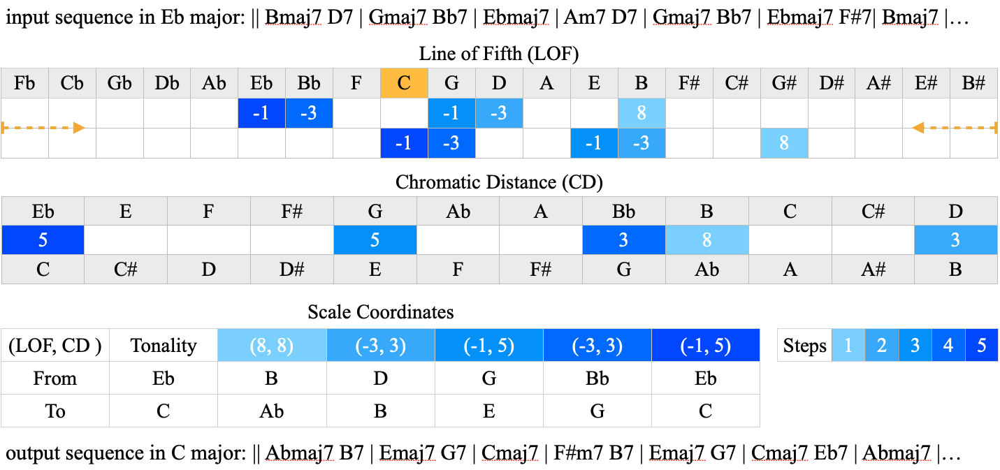

[](https://creativecommons.org/licenses/by-nc/4.0/)
[](https://opensource.org/licenses/MIT)


This is the repository for the paper
# ChromaFlow: Modelling And Generating Harmonic Progressions With a Transformer And Voicing Encodings
Modeling harmonic progressions in symbolic music notation. It encodes and produces musically coherent and varied chord progressions. We employ a transformer-based architecture trained on a comprehensive dataset of 48,072 songs, which includes an augmented set of 4,300 original pieces from the _iReal Pro_ application transposed across all chromatic keys. We introduce a novel tokenization and voicing encoding strategy designed to enhance the musicality of the generated chord progressions.

## Dataset
The dataset is formed with original 4,300 songs from _iReal Pro_. It contains chords and structural data from musicXML files and metadata (style, time signature, tonality, composer, title). A custom song parser included which extracts bars (measures), chords (root notes, qualities, extensions, slash chords, duration), and form (repeat bars, sectional jumps, codas).
Distribution of Styles in the dataset:

<div align="center">

</div>

## Data Augmentation
Custom Data Augmentation was implemented to avoid _music21_ errors with enharmonics. 
<div align="center">

</div>

Visualizing the process of song transposition. In this case, we transpose Eb major to C major. The example is a fragment of Giant Steps. The time steps of each chord transposed are shown on a blue scale, from light blue to dark blue. A tuple distance coordinate is used to transpose; the first one is the "line of fifth" (LOF) distance, and the second is the distance in the chromatic scale (CD). The LOF is useful when checking tonality relations, e.g., if the distance of a dominant chord is 13 in the LOF, the chord is corrected to its enharmonic distance -1. It is shown in the Abmaj7, corrected after Eb7 G#maj7

## License
This project is licensed under the **Creative Commons Attribution-NonCommercial 4.0 International (CC BY-NC 4.0)**.

You are free to:
- **Share** — copy and redistribute the material in any medium or format
- **Adapt** — remix, transform, and build upon the material

**Under the following terms:**

- **Attribution** — You must give appropriate credit, provide a link to the license, and indicate if changes were made. You may do so in any reasonable manner, but not in any way that suggests the licensor endorses you or your use.
- **NonCommercial** — You may not use the material for commercial purposes.

For more details, see the full license at [Creative Commons CC BY-NC 4.0](https://creativecommons.org/licenses/by-nc/4.0/).

## Citation
If you use this work in your research, please cite it as follows:

```bibtex
@inproceedings{dalmazzo2024chromaflow,
    author = {David Dalmazzo and Ken Déguernel and Bob L. T. Sturm},
    title = {ChromaFlow: Modeling And Generating Harmonic Progressions With a Transformer And Voicing Encoding},
    booktitle = {15th International Workshop on Machine Learning and Music (MML 2024)},
    year = {2024},
    month = {September},
    address = {Vilnius, Lithuania},
    url = {https://github.com/Dazzid/chromaflow_1.1},
}

