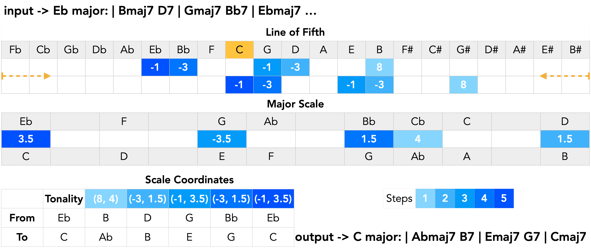

This is the repository for the paper
# ChromaFlow: Modelling And Generating Harmonic Progressions With a Transformer And Voicing Encodings

Custom Data Augmentation was implemented to avoid music21 errors with enharmonics. 

Visualizing the process of song transposition. In this case, we transpose Eb major to C major. The example is a fragment of "\textit{Giant Steps}". The time steps of each chord transposed are shown on a blue scale, from light blue to dark blue. A tuple distance coordinate is used to transpose; the first one is the "line of fifth" (LOF) distance, and the second is the distance in the chromatic scale (CD). The LOF is useful when checking tonality relations, e.g., if the distance of a dominant chord is 13 in the LOF, the chord is corrected to its enharmonic distance -1. It is shown in the Abmaj7, corrected after Eb7 G#maj7

Distribution of Styles in the dataset

